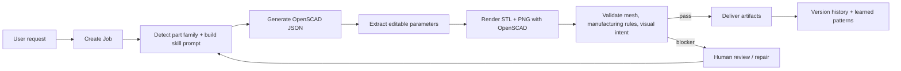

# AgentSCAD

AgentSCAD is a full-stack AI-powered CAD job management platform. It translates natural-language requests into parametric OpenSCAD code through a multi-stage AI pipeline, tracking the design lifecycle from intake to delivery.

## Features

- **Natural Language to CAD**: Uses advanced LLMs to infer part families, generate parametric schemas, and write OpenSCAD geometry.
- **Multi-Stage Pipeline**: Organized state machine (Intake → Generate → Render → Validate → Deliver). Validation blockers keep rendered artifacts available for review (HUMAN_REVIEW) instead of blocking the pipeline.
- **Multi-Provider LLM Support**: Supports over 30 models from 8 providers (OpenAI, Anthropic, Google, DeepSeek, OpenRouter, Zhipu, Qwen, Mistral).
- **Live Workspace Updates**: Server-Sent Events (SSE) stream active generation progress, while the job workspace refreshes automatically.
- **Parametric Editing**: Instantly tweak CAD parameters (like wall thickness or teeth count) within schema constraints.
- **Artifact-First SCAD**: Treats generated OpenSCAD as the source of truth and extracts editable numeric parameters from top-level SCAD assignments.
- **Managed OpenSCAD Libraries**: Can install approved OpenSCAD libraries into a local managed bundle with license gates.
- **Audit Trails**: Field-level version tracking for parameters and SCAD source changes.

## Architecture

- **Frontend**: React 19 + Next.js 16 App Router + Tailwind CSS v4 + Shadcn UI
- **Backend API**: Next.js Route Handlers
- **Database**: SQLite with Prisma ORM
- **Reverse Proxy**: Caddy (Port 81)

### Repo Mental Model

AgentSCAD is organized like a production agent project rather than a single prompt demo:

| Layer | What it owns | Where to look |
|---|---|---|
| Agent workflow | Job state machine, retries, SSE progress, automatic workspace refresh | `src/lib/pipeline/`, `src/app/api/jobs/[id]/process/route.ts`, `src/app/api/cron/route.ts` |
| Skills | CAD reasoning contracts, repair strategy, validation review, library usage policy | `skills/scad-*`, `skills/RESOLVER.md` |
| Tools | Deterministic render, validation, SCAD sanitization, parameter extraction, artifact IO | `src/lib/tools/`, `scripts/validate_stl.py` |
| Memory | Job state, version history, generated artifacts, learned patterns from edits | `prisma/schema.prisma`, `src/lib/version-tracker.ts`, `src/lib/improvement-analyzer.ts`, `skills/scad-generation/learned-patterns.json` |
| Workspace UI | CAD viewport, job queue, parameter editing, chat, review panels | `src/components/cad/`, `src/app/` |

### Agent Workflow

The main loop is a CAD-specific generate-check-repair workflow:



At runtime, `executeCadJob()` owns the state transitions:

| Stage | State / step | What happens |
|---|---|---|
| Intake | `NEW` / `starting` | Load the job, merge parameter values, detect intent and part family. |
| Generation | `NEW` / `generating_llm` | Load Markdown skills, library availability, family schemas, and learned patterns; call the selected model for strict JSON. |
| Source of truth | `SCAD_GENERATED` | Persist `scadSource`, parameter schema/values, design metadata, and execution logs. |
| Rendering | `RENDERED` or `GEOMETRY_FAILED` | Run OpenSCAD through deterministic tools and write artifacts under `/artifacts/{jobId}/`. |
| Validation | `VALIDATED` or `HUMAN_REVIEW` | Run mesh/manufacturing/visual validation. Critical blockers keep artifacts available for review. |
| Delivery | `DELIVERED` | Mark completion and expose final STL, preview, SCAD, and report paths. |
| Recovery | `REPAIRING`, retry cron, or manual apply | Repair routes and cron can re-enter the same render/validation workflow. |

Active generation progress is streamed to the browser through SSE. The broader workspace uses lightweight polling to keep job lists current without a separate realtime service.

### Memory System

AgentSCAD uses explicit product memory instead of opaque chat history. The goal is to make every model, edit, and validation result inspectable.

| Memory type | Stored data | Purpose |
|---|---|---|
| Working memory | Current `Job` fields: state, request, part family, parameters, SCAD source, render paths, validation results, execution logs | Lets the pipeline resume, retry, repair, and render the current CAD job deterministically. |
| Episodic memory | `JobVersion` rows for parameter, SCAD source, and note edits | Gives the workspace an audit trail of what changed, who changed it, and when. |
| Artifact memory | `public/artifacts/{jobId}/model.scad`, `model.stl`, `preview.png`, and report paths | Keeps generated CAD outputs inspectable outside the model response. |
| Skill memory | Markdown skills, per-family schemas, library policy manifest, and in-process skill/schema caches | Makes CAD behavior editable as files while keeping prompt contracts stable at runtime. |
| Learned memory | `skills/scad-generation/learned-patterns.json` generated from user edit analysis | Feeds recurring user corrections back into future generation prompts as optional guidance. |

The learning loop is deliberately conservative: user edits are tracked by `trackVersion()`, `POST /api/cron` can run `analyze-edits`, `improvement-analyzer` extracts parameter drift, common SCAD patches, and repeated validation failures, then `skill-resolver` injects those patterns into future generation prompts for the same part family. Learned patterns improve defaults and guidance, but they do not override deterministic validation or runtime contracts.

### Agent Architecture: Runtime Harness, CAD Skills

AgentSCAD keeps CAD judgment in Markdown skills and deterministic execution in TypeScript/Python tools. Skills such as `scad-generation`, `scad-repair`, `scad-validation-review`, `scad-chat`, `scad-visual-validate`, and the `scad-library-*` skills describe how the model should reason about CAD, repair, validation, manufacturing review, and library usage. The harness loads those skills, calls the model, parses structured JSON, records traces, and delegates deterministic work.

OpenSCAD rendering, artifact paths, Prisma writes, SCAD sanitization, SSE framing, file IO, Python/trimesh validation, and tests stay in code. Runtime contracts are intentionally stable: SSE uses raw `data: {json}\n\n` frames, public artifacts stay under `/artifacts/{jobId}/`, and validation results keep the `rule_id`, `rule_name`, `level`, `passed`, `is_critical`, `message` shape.

The generation path is artifact-first: the OpenSCAD source is the source of truth, and AgentSCAD deterministically extracts editable numeric parameters from top-level SCAD assignments. Model-provided parameter JSON is treated as compatibility metadata and fallback, not as the primary CAD representation.

The HTTP process route is intentionally thin. `src/app/api/jobs/[id]/process/route.ts` validates request state and streams SSE frames, while `src/lib/pipeline/execute-cad-job.ts` owns the current runtime state machine. Shared tools under `src/lib/tools/` handle rendering, validation, SCAD sanitization, OpenSCAD library resolution, and parameter extraction.

### Managed OpenSCAD Libraries

AgentSCAD may use approved OpenSCAD libraries when the runtime reports them as available. The approved library catalog lives in `skills/scad-library-policy/manifest.json`; it records source repositories, pinned commits, detection files, include examples, and license gates.

The default managed library directory is outside the repository:

```bash
~/.cadcad/openscad-libraries
```

Install default-approved libraries:

```bash
npm run scad:libs:install
```

Check installed libraries:

```bash
npm run scad:libs:check
```

These commands are thin wrappers around Python scripts, so Bun is not required for OpenSCAD library setup. You can also run them directly:

```bash
python3 skills/scad-library-policy/scripts/install_scad_libraries.py
python3 skills/scad-library-policy/scripts/check_scad_libraries.py
```

Default installation currently includes BOSL2, Round-Anything, and MCAD. GPL libraries such as NopSCADlib are not installed by default; installing them requires an explicit opt-in:

```bash
npm run scad:libs:install:gpl
```

Generated SCAD may reference available libraries with `include` or `use`, but AgentSCAD does not copy third-party library source into generated SCAD. Keep third-party library source out of this repository unless a human explicitly reviews and approves the licensing and distribution model.

## Getting Started

### Quick Start

Requirements: Node.js 18+ and OpenSCAD in your PATH.

```bash
npm install
cp .env.example .env
npm run db:push
npm run dev:all
```

Open `http://localhost:3000`.

`npm run dev:all` starts the local Next.js app/API. It works on macOS, Linux, WSL, and Windows PowerShell.

### Optional Setup

- Add API keys in `.env` for model generation.
- Install managed OpenSCAD libraries when you want generated SCAD to use BOSL2, Round-Anything, or MCAD:
  ```bash
  npm run scad:libs:install
  npm run scad:libs:check
  ```
- Bun is optional for development, but the current test command uses Bun:
  ```bash
  bun test
  ```

The dev stack uses:

| Service | Port | Purpose |
|---|---:|---|
| Next.js app/API | 3000 | UI, route handlers, SSE job processing |

For the explicit app-only alias:

```bash
npm run dev:app
```

## Common Commands

| Task | Command |
|---|---|
| Dev app | `npm run dev:all` or `npm run dev` |
| Dev app alias | `npm run dev:app` |
| Build | `bun run build` |
| Test | `bun test` or `bun run test` |
| Lint | `bun run lint` |
| Check OpenSCAD libraries | `npm run scad:libs:check` or `python3 skills/scad-library-policy/scripts/check_scad_libraries.py` |
| Install default OpenSCAD libraries | `npm run scad:libs:install` or `python3 skills/scad-library-policy/scripts/install_scad_libraries.py` |
| Install GPL OpenSCAD libraries explicitly | `npm run scad:libs:install:gpl` or `python3 skills/scad-library-policy/scripts/install_scad_libraries.py --include-gpl` |

## Project Structure

- `/src/app/api/`: REST APIs, thin HTTP/SSE adapters, SCAD apply routes
- `/src/components/cad/`: Domain-specific React components
- `/src/lib/pipeline/`: CAD job runtime state machine
- `/src/lib/harness/`: Skill runner and structured-output normalization
- `/src/lib/tools/`: Deterministic rendering, validation, library resolution, sanitization, artifact, and parameter tools
- `/src/lib/stores/`: Shared persistence helpers
- `/prisma/`: ORM schema and database setup
- `/skills/`: AI model capabilities, SCAD generation/repair/library policy, library usage guides, and deterministic skill scripts
- `/DESIGN.md`: Design system, visual direction, and workspace principles

### CAD Skill Map

These skills are the "fat" CAD judgment layer. The TypeScript/Python harness loads them as prompt contracts, then keeps rendering, validation, storage, and streaming in deterministic code.

| Skill | Role in the CAD pipeline | Paired deterministic code |
|---|---|---|
| `skills/scad-generation/` | Generates strict JSON with `summary`, compatibility parameter metadata, and complete `scad_source`. It owns CAD intent, printable defaults, top-level editable assignments, and artifact-first modeling rules. | `src/lib/harness/`, `src/lib/skill-resolver.ts`, `src/lib/pipeline/execute-cad-job.ts`, `src/lib/tools/scad-parameter-extractor.ts` |
| `skills/scad-repair/` | Repairs broken or failed OpenSCAD while preserving design intent and runtime contracts. It returns repaired SCAD plus a short risk/summary payload. | `src/app/api/jobs/[id]/repair/route.ts`, `src/lib/tools/scad-renderer.ts`, validation tools under `src/lib/tools/` |
| `skills/scad-validation-review/` | Reviews render logs, artifacts, and validation results to decide whether a job can proceed, needs repair, or needs human review. | `src/lib/pipeline/execute-cad-job.ts`, `src/lib/tools/validation-tool.ts`, `scripts/validate_stl.py` |
| `skills/scad-visual-validate/` | Compares rendered previews against the user request to catch visible intent failures that mesh checks cannot see. | `src/lib/visual-validator.ts`, preview artifacts under `public/artifacts/{jobId}/` |
| `skills/scad-chat/` | Provides conversational CAD help, SCAD explanations, parameter advice, and user-facing SCAD patches outside the main generation pipeline. | `src/app/api/chat/route.ts`, CAD chat UI components under `src/components/cad/` |
| `skills/scad-improvement/` | Documents the feedback loop that learns from user edits, parameter drift, SCAD patches, and validation failures. | `src/lib/improvement-analyzer.ts`, `src/lib/version-tracker.ts`, `skills/scad-generation/learned-patterns.json` |
| `skills/scad-library-policy/` | Decides which external OpenSCAD libraries may be used, enforces license gates, validates includes, and manages the approved library manifest. | `src/lib/tools/scad-library-resolver.ts`, `skills/scad-library-policy/scripts/*.py`, `skills/scad-library-policy/manifest.json` |
| `skills/scad-library-bosl2/` | Guidance for BOSL2-assisted rounded solids, chamfers, anchors, transforms, arrays, and higher-quality parametric geometry. | Runtime library resolver supplies exact `include <BOSL2/std.scad>` availability and renderer `OPENSCADPATH` |
| `skills/scad-library-round-anything/` | Guidance for Round-Anything sketch profiles, rounded extrusions, tabs, brackets, shells, and softened consumer-style parts. | Runtime library resolver supplies exact `use <Round-Anything/polyround.scad>` or equivalent availability |
| `skills/scad-library-mcad/` | Guidance for MCAD mechanical primitives, especially involute gears and established OpenSCAD mechanical helpers. | Runtime library resolver supplies exact MCAD include/use paths |
| `skills/scad-library-nopscadlib/` | Guidance for NopSCADlib electronics enclosures, vitamins, fans, boards, fasteners, and assembly-aware hardware. GPL-gated by policy. | Library installer/checker scripts and manifest license gates |
| `skills/scad-library-threads/` | Guidance for `threads.scad` or `threadlib` when generated parts need printable threaded holes, bolts, caps, or adapters. | Runtime library resolver ensures only one available thread library is used per artifact |
