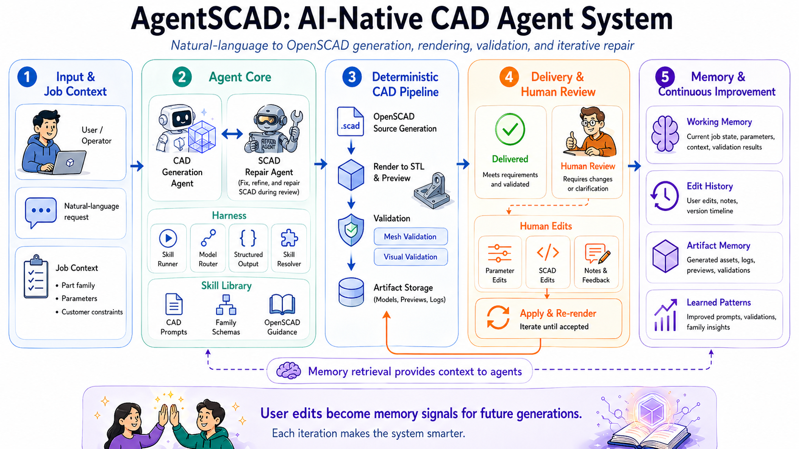
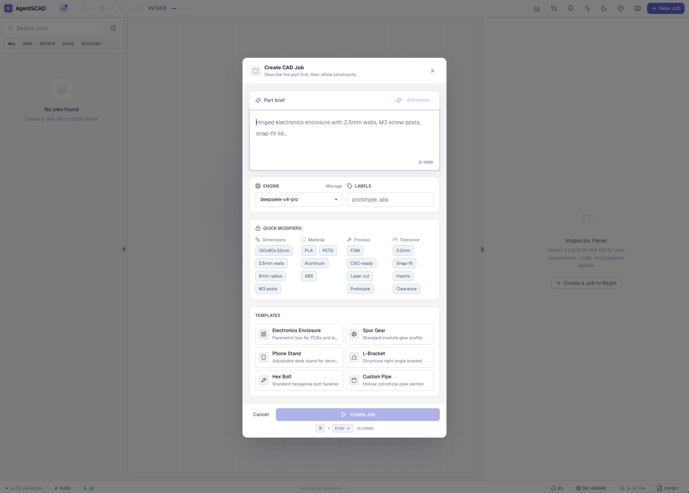
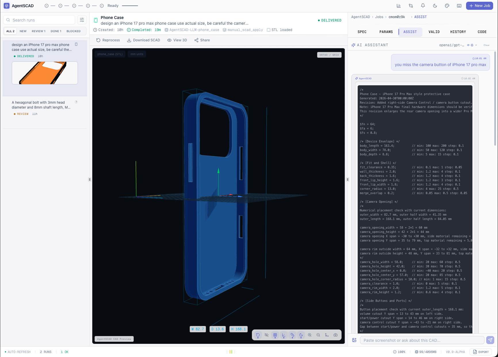
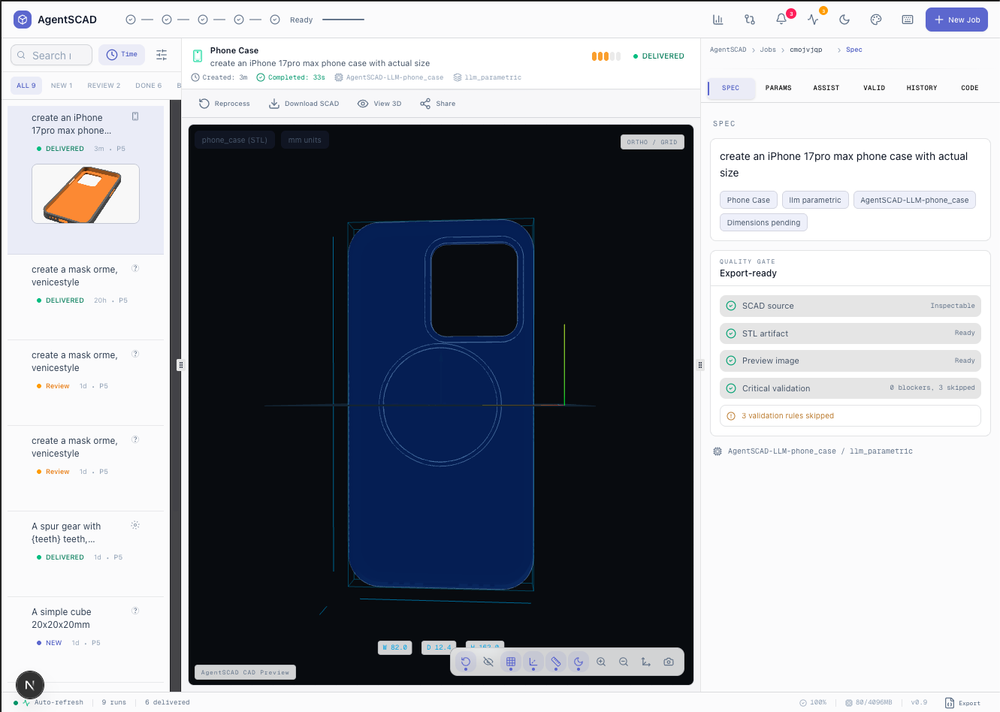

**English** | [中文](./README_CN.md)

# AgentSCAD


AgentSCAD is an AI-native CAD agent that turns natural-language part requests into validated OpenSCAD artifacts.

It uses a **progressive pipeline**: one LLM call generates structured CAD intent and library-backed OpenSCAD by default. Expensive steps — LLM repair and VLM visual validation — run only on failure or on user request.



AgentSCAD combines one-shot structured CAD generation, deterministic local validation, validation-driven repair, and user-triggered visual refinement.

## Why AgentSCAD?

Most text-to-CAD demos stop at code generation. AgentSCAD treats CAD as an artifact pipeline with cost-aware defaults:

1. **One LLM call** generates structured CAD intent, modeling plan, validation targets, and library-backed OpenSCAD.
2. Extract editable parameters from top-level SCAD assignments.
3. Render STL and preview images with deterministic OpenSCAD CLI.
4. **Local deterministic validation**: compile check, mesh manifold, bounding box, component count, hole count via Euler characteristic.
5. **Repair on failure only**: if validation fails, one automatic LLM repair with validation feedback.
6. **Visual repair on user request**: VLM-based visual inspection only when the user clicks "Visual Repair" after seeing the preview.
7. Store edits, artifacts, and learned patterns for future jobs.

## Demo Flow







The main workflow is:

1. Describe a part in natural language and choose the model/provider.
2. **One-shot generation**: structured CAD intent + parameterized OpenSCAD in one LLM call, backed by local example retrieval and the AgentSCAD standard library.
3. Render `model.stl` and `preview.png` through the local OpenSCAD CLI.
4. Review deterministic validation results (compile, mesh, bbox, components, hole count).
5. If validation fails: one automatic LLM repair attempt with validation feedback.
6. If visual issues remain: click **Visual Repair** to run VLM-based image analysis and targeted SCAD fix.
7. Edit extracted parameters or SCAD, then re-render, repair, or export the STL.

### Pipeline Architecture

```
Default path (1 LLM call):
  Prompt → CAD JSON + SCAD → OpenSCAD render → deterministic validation → result

Failure path (2 LLM calls max):
  Validation failed → one repair call → re-render → result or human_review

Visual path (user-triggered):
  User sees preview → clicks Visual Repair → VLM feedback → repaired SCAD
```

### Benchmark

```bash
bun run cad:eval         # all benchmark cases
bun run cad:eval -- --fast  # simple cases only
bun run cad:eval -- --model deepseek  # with specific model
bun run cad:eval:report  # parse results as JSON
```

Key metrics: compile success rate, geometry pass rate, repair success rate, average LLM calls per job, average latency per job.

## OpenSCAD Runtime Boundary

AgentSCAD does not bundle or link OpenSCAD in the default application distribution.

OpenSCAD is invoked as an external command-line renderer through `OPENSCAD_BIN`
or the `openscad` executable available in the user's runtime environment.

Users and distributors who install, package, or redistribute OpenSCAD are responsible
for complying with OpenSCAD's GPL license terms.

## Quick Start

Requirements: Node.js 20 or 22 LTS, Bun, and OpenSCAD in your PATH.

Install OpenSCAD from <https://openscad.org/downloads.html>, then ensure `openscad` is available in your terminal.

```bash
bun install --frozen-lockfile
test -f .env || cp .env.example .env
mkdir -p db
touch db/dev.db
bun run db:push
bun run dev:all
```

Open `http://localhost:3000`.

`bun run dev:all` starts the local Next.js app/API.

Bun is the tested package manager for this repo because the project commits `bun.lock`, uses `bun test`, and runs the production standalone server with Bun. npm can also run the development app:

```bash
npm install
npm run db:push
npm run dev:all
```

If you use npm, avoid committing the generated `package-lock.json` unless the project intentionally switches package managers. Tests still require Bun because the test script uses `bun test`.

On Windows PowerShell, use this equivalent for the setup shell commands:

```powershell
if (!(Test-Path .env)) { Copy-Item .env.example .env }
New-Item -ItemType Directory -Force db
if (!(Test-Path db/dev.db)) { New-Item -ItemType File db/dev.db }
bun install --frozen-lockfile
bun run db:push
bun run dev:all
```

## First-Run Walkthrough

1. Start the app with `bun run dev:all`.
2. Open `http://localhost:3000`.
3. Create a new job with a prompt such as:

```text
Create a wall-mountable phone holder with rounded corners and two screw holes.
```

4. Pick a configured model provider, or use the built-in fallback/template path if you are evaluating the UI and pipeline shape.
5. Inspect the generated preview, STL readiness, SCAD source, validation report, and editable parameters.
6. Change a parameter such as wall thickness or screw-hole diameter, re-render, then export the STL.

## What Works Without API Keys?

You can clone the repo, install dependencies, open the workspace UI, initialize SQLite, inspect any local artifacts that are present, edit SCAD/parameters, and run deterministic OpenSCAD rendering and mesh/manufacturing validation with no paid model key.

LLM-backed CAD generation, repair, chat help, and visual-intent review work best when at least one provider is configured in `.env` or through provider settings. Visual validation specifically uses `MIMO_API_KEY`; if it is missing, AgentSCAD records that check as skipped rather than blocking the job.

## Configuration

Model providers are optional for local exploration and required for full AI-assisted generation/repair quality. Start by copying `.env.example` to `.env`, then add the providers you want to use.

Common variables:

| Variable | Required | Purpose |
|---|---:|---|
| `DATABASE_URL` | Yes | SQLite database path used by Prisma. Defaults to `file:../db/dev.db`. |
| `MIMO_API_KEY` | Optional | Enables MiMo generation fallback and visual validation. |
| `OPENROUTER_API_KEY` | Optional | Enables OpenRouter model routing. |
| `DEEPSEEK_API_KEY` | Optional | Enables DeepSeek model routing. |
| `OPENAI_API_KEY`, `ANTHROPIC_API_KEY`, `DASHSCOPE_API_KEY`, etc. | Optional | Enable additional configured providers. |
| `AGENTSCAD_OPENSCAD_LIBRARY_DIR` | Optional | Overrides the managed OpenSCAD library directory. |
| `OPENSCAD_LIBRARY_PATHS` | Optional | Adds extra local OpenSCAD library search paths. |
| `CRON_SECRET` | Production | Protects the cron endpoint in production. |
| `API_SECRET` | Production | Protects job/chat API routes in production. |

Optional OpenSCAD library setup:

Install approved OpenSCAD libraries:

```bash
bun run scad:libs:install
bun run scad:libs:check
```

Run tests with Bun:

```bash
bun test
```

## Features

- **Artifact-first CAD generation**: OpenSCAD source is the source of truth; model-provided parameter JSON is compatibility metadata and fallback.
- **CAD generation and repair agents**: A generation agent creates OpenSCAD artifacts, while a repair agent fixes failed geometry, validation blockers, and human-review edits.
- **Validation-driven workflow**: When validation fails, AgentSCAD keeps the generated STL, preview, and SCAD available for inspection, then routes the job into human review or repair.
- **Live workspace updates**: Server-Sent Events stream active generation progress, and the job workspace refreshes automatically.
- **Parametric editing**: Users can tweak extracted CAD parameters such as wall thickness, hole diameter, or gear teeth within schema constraints.
- **Edit-derived memory**: Version history and edit analysis feed recurring corrections back into future generation prompts.
- **Managed OpenSCAD libraries**: Approved libraries such as BOSL2, Round-Anything, and MCAD can be installed into a local managed bundle with license gates.
- **Multi-provider LLM support**: The runtime can route generation through OpenAI, Anthropic, Google, DeepSeek, OpenRouter, Zhipu, Qwen, Mistral, and other configured providers.

## Example Job

Input:

```text
Create a wall-mountable phone holder with rounded corners and two screw holes.
```

Output:

- `model.scad`: parametric OpenSCAD source with editable top-level assignments.
- `model.stl`: rendered mesh.
- `preview.png`: generated preview image.
- Validation report: mesh, manufacturing, and visual-intent checks.
- Editable parameters: constrained values exposed in the workspace UI.

AgentSCAD is centered around two CAD agents: a generation agent that creates OpenSCAD artifacts, and a repair agent that fixes failed geometry, validation blockers, or human-review edits. The workspace chat helper stays outside the main generation pipeline and is used for CAD explanations, parameter advice, and user-facing SCAD patches.

## Repo Mental Model

| Layer | What it owns | Where to look |
|---|---|---|
| Agent workflow | Job state machine, retries, SSE progress, automatic workspace refresh | `src/lib/pipeline/`, `src/app/api/jobs/[id]/process/route.ts`, `src/app/api/cron/route.ts` |
| Skills | CAD reasoning contracts, repair strategy, validation review, library usage policy | `skills/scad-*`, `skills/RESOLVER.md` |
| Tools | Deterministic render, validation, SCAD sanitization, parameter extraction, artifact IO | `src/lib/tools/`, `scripts/validate_stl.py` |
| Memory | Job state, version history, artifacts, structured learned observations (v3.0: append-only JSONL, pipeline-triggered) | `prisma/schema.prisma`, `src/lib/version-tracker.ts`, `src/lib/improvement-analyzer.ts`, `skills/scad-generation/learned-observations.jsonl` |
| Workspace UI | CAD viewport, job queue, parameter editing, review panels, chat helper | `src/components/cad/`, `src/app/` |

## Memory at a Glance

AgentSCAD uses explicit product memory instead of opaque chat history:

- **Working memory**: current job state, request, parameters, SCAD source, artifacts, validation results, and logs.
- **Episodic memory**: field-level `JobVersion` history for parameter, source, and note edits.
- **Artifact memory**: generated `model.scad`, `model.stl`, `preview.png`, and reports under `public/artifacts/{jobId}/`.
- **Skill memory**: Markdown CAD skills, schemas, library policy, and in-process skill/schema caches.
- **Learned memory**: structured numerical observations (v3.0) extracted from user edits, validation failures, and repair outcomes. Pipeline-triggered writes, append-only JSONL, prompt injection defense on user content.

Learned memory is used as prompt-time guidance, not as an override for rendering or validation.

**v3.0 improvements**: Observations are structured numerical data (not prose), stored in append-only JSONL for data safety, and written automatically by the pipeline on job completion and validation events. Source trust levels (user_edit > repair_success > validation_pattern) give higher confidence to user-driven changes. Prompt injection defense sanitizes user-sourced SCAD content before it enters the generation prompt. Quality metrics (delivery rate, repair rate) close the feedback loop — the system knows not just what users change, but whether those changes lead to successful deliveries.

See the [Memory at a Glance](#memory-at-a-glance) section above for the memory design overview.

## Skills at a Glance

The CAD skill layer keeps model-facing judgment editable as Markdown while deterministic code handles rendering, validation, storage, and streaming.

| Skill | Role |
|---|---|
| `skills/scad-generation/` | Creates strict JSON containing a summary, compatibility parameter metadata, and complete `scad_source`. |
| `skills/scad-repair/` | Repairs broken or failed OpenSCAD while preserving design intent and runtime contracts. |
| `skills/scad-validation-review/` | Reviews render logs, artifacts, and validation results to decide deliver, repair, or human review. |
| `skills/scad-visual-validate/` | Compares rendered previews against the user request to catch visible intent failures. |
| `skills/scad-improvement/` | Documents the edit-analysis loop that learns from user corrections. |
| `skills/scad-library-*` | Guides approved external OpenSCAD library usage with runtime availability and license gates. |
| `skills/scad-chat/` | Provides workspace CAD help outside the main generation pipeline. |

See [docs/SKILLS.md](./docs/SKILLS.md) for the full CAD skill map.

## Managed OpenSCAD Libraries

The approved library catalog lives in `skills/scad-library-policy/manifest.json`. It records source repositories, pinned commits, detection files, include examples, and license gates.

The default managed library directory is outside the repository:

```bash
~/.agentscad/openscad-libraries
```

Install and check default-approved libraries:

```bash
bun run scad:libs:install
bun run scad:libs:check
```

Default installation currently includes BOSL2, Round-Anything, and MCAD. GPL libraries such as NopSCADlib are not installed by default; installing them requires an explicit opt-in:

```bash
bun run scad:libs:install:gpl
```

Generated SCAD may reference available libraries with `include` or `use`, but AgentSCAD does not copy third-party library source into generated SCAD.

## Status

AgentSCAD is an active prototype for AI-native CAD workflows. It is designed for local experimentation with OpenSCAD-based parametric parts.

Current limitations:

- Generated CAD should be reviewed before manufacturing.
- OpenSCAD must be installed locally.
- Visual validation depends on configured model providers.
- Learned memory is conservative and used as guidance, not automatic retraining.

## Common Commands

| Task | Command |
|---|---|
| Dev app | `bun run dev:all` or `bun run dev` |
| Dev app alias | `bun run dev:app` |
| Build | `bun run build` |
| Test | `bun test` or `bun run test` |
| Lint | `bun run lint` |
| Audit dependency licenses | `bun run license:audit` |
| Check OpenSCAD libraries | `bun run scad:libs:check` |
| Install default OpenSCAD libraries | `bun run scad:libs:install` |
| Install GPL OpenSCAD libraries explicitly | `bun run scad:libs:install:gpl` |

Reviewed third-party license obligations are tracked in [THIRD_PARTY_NOTICES.md](./THIRD_PARTY_NOTICES.md). Run `bun run license:audit` before changing package dependencies or OpenSCAD library policy.

## Project Structure

- `/src/app/api/`: REST APIs, thin HTTP/SSE adapters, SCAD apply routes.
- `/src/components/cad/`: Domain-specific React components.
- `/src/lib/pipeline/`: CAD job runtime state machine.
- `/src/lib/harness/`: Skill runner and structured-output normalization.
- `/src/lib/tools/`: Deterministic rendering, validation, library resolution, sanitization, artifact, and parameter tools.
- `/src/lib/stores/`: Shared persistence helpers.
- `/prisma/`: ORM schema and database setup.
- `/skills/`: AI model capabilities, SCAD generation/repair/library policy, usage guides, and deterministic skill scripts.
- `/docs/`: Architecture, memory, skills, and frontend design notes.

## Deeper Docs

- [Architecture](./docs/ARCHITECTURE.md)
- [Skills](./docs/SKILLS.md)
- [Frontend redesign plan](./docs/FRONTEND_REDESIGN_PLAN.md)
- [Design system](./DESIGN.md)

## License

MIT - see [LICENSE](./LICENSE) for details.
