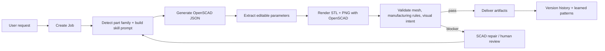

# AgentSCAD Architecture

AgentSCAD is organized like a production agent project rather than a single prompt demo. The model-facing layer describes CAD reasoning in Markdown skills; the runtime layer keeps rendering, validation, persistence, artifact paths, and streaming in deterministic code.

## Stack

- **Frontend**: React 19 + Next.js 16 App Router + Tailwind CSS v4 + Shadcn UI
- **Backend API**: Next.js Route Handlers
- **Database**: SQLite with Prisma ORM
- **Reverse proxy**: Caddy on port 81

## Repo Mental Model

| Layer | What it owns | Where to look |
|---|---|---|
| Agent workflow | Job state machine, retries, SSE progress, automatic workspace refresh | `src/lib/pipeline/`, `src/app/api/jobs/[id]/process/route.ts`, `src/app/api/cron/route.ts` |
| Skills | CAD reasoning contracts, repair strategy, validation review, library usage policy | `skills/scad-*`, `skills/RESOLVER.md` |
| Tools | Deterministic render, validation, SCAD sanitization, parameter extraction, artifact IO | `src/lib/tools/`, `scripts/validate_stl.py` |
| Memory | Job state, version history, generated artifacts, learned patterns from edits | `prisma/schema.prisma`, `src/lib/version-tracker.ts`, `src/lib/improvement-analyzer.ts`, `skills/scad-generation/learned-patterns.json` |
| Workspace UI | CAD viewport, job queue, parameter editing, review panels, chat helper | `src/components/cad/`, `src/app/` |

## Runtime Workflow



At runtime, `executeCadJob()` owns the state transitions:

| Stage | State / step | What happens |
|---|---|---|
| Intake | `NEW` / `starting` | Load the job, merge parameter values, detect intent and part family. |
| Generation | `NEW` / `generating_llm` | Load Markdown skills, library availability, family schemas, and learned patterns; call the selected model for strict JSON. |
| Source of truth | `SCAD_GENERATED` | Persist `scadSource`, parameter schema/values, design metadata, and execution logs. |
| Rendering | `RENDERED` or `GEOMETRY_FAILED` | Run OpenSCAD through deterministic tools and write artifacts under `/artifacts/{jobId}/`. |
| Validation | `VALIDATED` or `HUMAN_REVIEW` | Run mesh/manufacturing/visual validation. Critical blockers keep artifacts available for review. |
| Delivery | `DELIVERED` | Mark completion and expose final STL, preview, SCAD, and report paths. |
| Recovery | `REPAIRING`, retry cron, or manual apply | Repair routes and cron can re-enter the same render/validation workflow. |

## Runtime Contracts

The HTTP process route is intentionally thin. `src/app/api/jobs/[id]/process/route.ts` validates request state and streams SSE frames, while `src/lib/pipeline/execute-cad-job.ts` owns the current runtime state machine.

Stable contracts:

- SSE uses raw `data: {json}\n\n` frames.
- Public artifacts stay under `/artifacts/{jobId}/`.
- Validation results keep the `rule_id`, `rule_name`, `level`, `passed`, `is_critical`, `message` shape.
- Generated OpenSCAD source is the source of truth.
- Editable numeric parameters are extracted from top-level SCAD assignments.
- Model-provided parameter JSON is compatibility metadata and fallback, not the primary CAD representation.

Shared tools under `src/lib/tools/` handle rendering, validation, SCAD sanitization, OpenSCAD library resolution, artifact IO, and parameter extraction.

## Realtime Updates

Active generation progress is streamed to the browser through SSE. The broader workspace uses lightweight polling to keep job lists current without a separate realtime service.

When validation fails, AgentSCAD keeps rendered artifacts available for inspection and routes the job to repair or human review instead of discarding the result.

## OpenSCAD Libraries

AgentSCAD may use approved OpenSCAD libraries when the runtime reports them as available. The approved library catalog lives in `skills/scad-library-policy/manifest.json`; it records source repositories, pinned commits, detection files, include examples, and license gates.

The default managed library directory is outside the repository:

```bash
~/.agentscad/openscad-libraries
```

Install default-approved libraries:

```bash
npm run scad:libs:install
```

Check installed libraries:

```bash
npm run scad:libs:check
```

These commands are thin wrappers around Python scripts, so Bun is not required for OpenSCAD library setup. You can also run them directly:

```bash
python3 skills/scad-library-policy/scripts/install_scad_libraries.py
python3 skills/scad-library-policy/scripts/check_scad_libraries.py
```

Default installation currently includes BOSL2, Round-Anything, and MCAD. GPL libraries such as NopSCADlib are not installed by default; installing them requires an explicit opt-in:

```bash
npm run scad:libs:install:gpl
```

Generated SCAD may reference available libraries with `include` or `use`, but AgentSCAD does not copy third-party library source into generated SCAD. Keep third-party library source out of this repository unless a human explicitly reviews and approves the licensing and distribution model.
